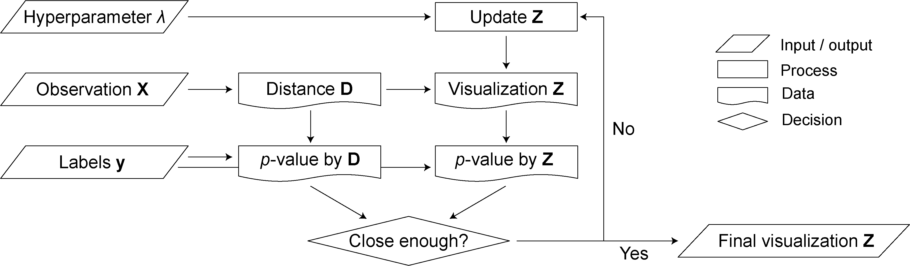

```{r, include = FALSE}
knitr::opts_chunk$set(
  collapse = TRUE,
  comment = "#>"
)
```

# About this vignette {.unnumbered}

This vignette describes how to perform *F*-informed multidimensional scaling using the `FinfoMDS` package. `FinfoMDS` was developed by Soobin Kim ([sbbkim\@ucdavis.edu](mailto:sbbkim@ucdavis.edu){.email}). A proposal of the method and its full description can be found at:

-   H Kim⋆, S Kim⋆, JA Kimbrel, MM Morris, X Mayali and CR Buie (2025). Multidimensional scaling informed by *F*-statistic: Visualizing grouped microbiome data with inference, *arXiv* (<https://arxiv.org/abs/2308.00354v2>).

This vignette was updated in August 2025.

# Introduction

Multidimensional scaling (MDS) is a dimensionality reduction technique used in microbial ecology data analysis to represent multivariate structures while preserving pairwise distances between samples. While its improvement has enhanced the ability to reveal data patterns by sample groups, these MDS-based methods often require prior assumptions for inference, limiting their broader application in general microbiome analysis.

Here, we introduce a new MDS-based ordination, ***F*****-informed MDS** (implemented in the R package `FinfoMDS`), which configures data distribution based on the *F*-statistic, the ratio of dispersion between groups that share common and different labels. Our approach offers a well-founded refinement of MDS that aligns with statistical test results, which can be beneficial for broader compositional data analyses in microbiology and ecology.

# Installation

## Bioconductor official release

To install the official release version of this package, start R (version "4.5") and enter:

```{r eval=FALSE}
BiocManager::install("FinfoMDS")
```

For older R versions, please refer to the appropriate Bioconductor release.

## GitHub development version

The package may be updated before changes are migrated to the official release. To install the development version, enter:

```{r eval=FALSE}
devtools::install_github("soob-kim/FinfoMDS")
```

# Operation

As introduced earlier, *F*-informed MDS is a microbiome data visualization tool designed to display statistical significance. The visualization (a 2D representation) output is obtained by iterating an optimization algorithm at each epoch. The procedure is summarized in the diagram below and is implemented in the `fmds()` function.



For `fmds()` function to operate, the following arguments are required: 1) labels `y`, 2) either a distance matrix `D` or a design matrix `X` (if both are provided, `D` takes precedence). Additionally, the following optional arguments can be adjusted according to user preference: 1) hyperparameter `lambda`, 2) initial representation `z0`, 3) maximum epoch number `nit`, and 4) stopping criterion `threshold_p`. Upon completion, `fmds()` returns a two-column matrix containing the coordinates representing the distance matrix `D`.

# Example

As an example, we use an algal-associated bacterial community (Kim et al., 2022). First, load a `phyloseq`-class object by typing:

```{r eval = TRUE}
library(FinfoMDS)
data("microbiome", package = "FinfoMDS")
```

Next, compute the weighted UniFrac distance from this dataset and obtain its label set:

```{r eval = TRUE}
require(phyloseq)
D <- distance(microbiome, method = 'wunifrac') # requires phyloseq package
y <- sample_data(microbiome)$Treatment
```

Then, compute the *F*-informed MDS by running:

```{r eval = TRUE}
result <- fmds(D = D, y = y, lambda = 0.3, threshold_p = 0.05)
```

This procedure will iterate until the 2D distributions converge, as long as the *p*-value does not deviate more than `threshold_p`, or until reaching the default maximum of 100 iterations, whichever occurs first. We have observed that setting lambda between 0.3 and 0.5 typically yields optimal results; however, this hyperparameter can be adjusted as long as it does not exceed 1.

The 2D representation of the community dataset is returned as a matrix and can be visualized by typing:

```{r eval = TRUE}
plot(result, pch = y)
```

# Reference

H Kim, JA Kimbrel, CA Vaiana, JR Wollard, X Mayali, and CR Buie (2022). Bacterial response to spatial gradients of algal-derived nutrients in a porous microplate. *The ISME Journal*, **16**(4):1036–1045.

# Session information

```{r}
sessionInfo()
```
